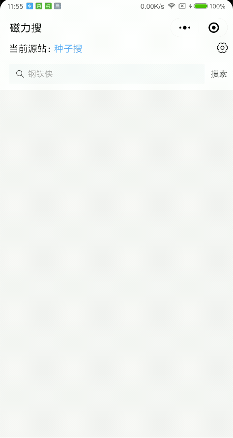
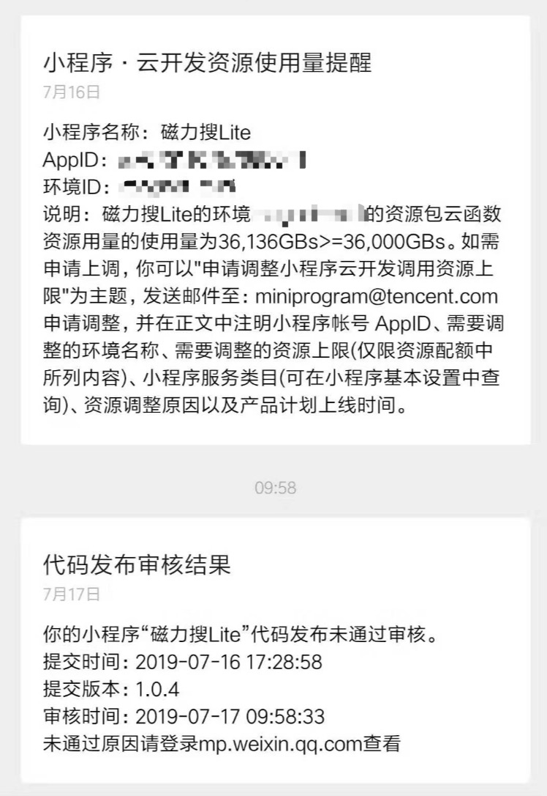

## 介绍
小程序基于[magnetW](https://github.com/dengyuhan/magnetW)的API实现，要本地调试小程序，需要先搭建[magnetW](https://github.com/dengyuhan/magnetW)来提供接口

## 截图

## 示例程序

#### 停止示例小程序的说明
由于云开发的配额超限，代码审核也不让通过了，所以将停止示例小程序，如要使用可以自行编译

## 本地编译
项目中使用[npm](https://developers.weixin.qq.com/miniprogram/dev/devtools/npm.html)构建	
由于小程序对请求的的限制，项目中用到了**云函数**，如果要在本地编译，还需要开通[云开发](https://developers.weixin.qq.com/miniprogram/dev/wxcloud/basis/getting-started.html)  

>*测试appid无法使用云开发

修改 [functions/requestGet](functions/requestGet/index.js) 中的`baseUrl`为`magnetW`的访问根目录，上传云函数

### 相关项目
[magnetW](https://github.com/dengyuhan/magnetW)  
[vant-weapp](https://github.com/youzan/vant-weapp)  
[got](https://github.com/sindresorhus/got)  
